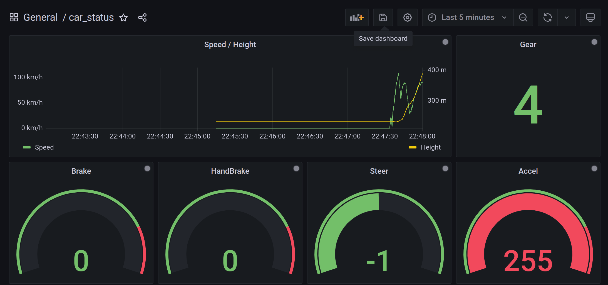

# horizon5-telemetry



### Start

```
export PORT=6000
export THRESHOLD=100
export URL=ws://10.10.1.104:3000/api/live/push/horizon5
export TOKEN=*
npm start 
```

### modificate protocol

```
node compile.js  > generated_parse_data.js
```